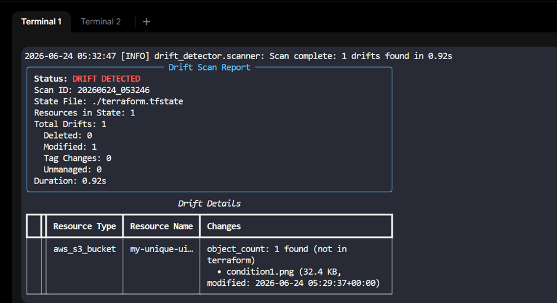
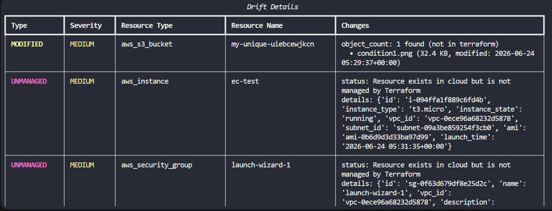

# Terraform Drift Detector

A cloud-agnostic platform that continuously compares Terraform state against actual cloud infrastructure to identify configuration drift — without running `terraform plan` or `apply`.

## Features

- **Fast Drift Detection** — Compares Terraform state file against live cloud APIs
- **Multiple Drift Types** — Detects deleted resources, modified attributes, tag changes, and unmanaged resources
- **Cloud Agnostic** — Extensible provider architecture (AWS implemented, Azure/GCP ready for extension)
- **On-Demand Scans** — Run scans instantly via CLI
- **Scheduled Scans** — Cron-based automatic scanning
- **Web Dashboard** — Real-time drift visibility in the browser
- **Multiple Output Formats** — Rich CLI tables, JSON reports, HTML reports
- **Severity Assessment** — Automatic classification of drift by impact level
- **Configurable** — YAML config with environment variable overrides

## Architecture

```
┌─────────────────┐     ┌──────────────────┐     ┌─────────────────┐
│  Terraform      │     │  Drift Scanner   │     │  Cloud Provider │
│  State File     │────▶│  (Orchestrator)  │────▶│  APIs           │
└─────────────────┘     └──────────────────┘     └─────────────────┘
                               │                         │
                               ▼                         ▼
                        ┌──────────────────┐     ┌─────────────────┐
                        │  State Parser    │     │  Provider        │
                        │  (Normalize)     │     │  Adapters       │
                        └──────────────────┘     └─────────────────┘
                               │                         │
                               └────────────┬────────────┘
                                            ▼
                                   ┌─────────────────┐
                                   │  Comparator     │
                                   │  (Diff Engine)  │
                                   └─────────────────┘
                                            │
                                            ▼
                               ┌────────────────────────┐
                               │     Drift Report       │
                               │  (Table/JSON/HTML/API) │
                               └────────────────────────┘
```

## Quick Start

### Installation

```bash
# Clone and install
pip install -e .

# Or install dependencies directly
pip install -r requirements.txt
```

### Basic Usage

```bash
# Run a scan against a local state file
drift-detector scan --state ./terraform.tfstate

# Output as JSON
drift-detector scan --state ./terraform.tfstate --format json

# Output as HTML report
drift-detector scan --format html

# Scan only specific resource types
drift-detector scan --include aws_instance --include aws_s3_bucket

# Skip certain resource types
drift-detector scan --skip aws_iam_policy

# Validate configuration and credentials
drift-detector validate
```

### Scheduled Scanning

```bash
# Start the watcher (scans on schedule)
drift-detector watch

# Custom cron schedule (every 2 hours)
drift-detector watch --cron "0 */2 * * *"
```

### Web Dashboard

```bash
# Start the dashboard
drift-detector dashboard

# Custom port
drift-detector dashboard --port 8080
```

Then open http://localhost:5000 in your browser.

## Configuration

Create a `config.yaml` in your project root:

```yaml
state:
  backend: local
  path: "./terraform.tfstate"

providers:
  aws:
    enabled: true
    region: "us-east-1"
    # profile: "my-aws-profile"

scheduler:
  enabled: false
  cron: "0 */6 * * *"

dashboard:
  host: "0.0.0.0"
  port: 5000

output:
  format: table  # table, json, html
  report_dir: "./reports"

detection:
  ignore_attributes:
    - arn
    - id
    - self_link
    - etag
  skip_resources: []
  include_resources: []
```

### Environment Variable Overrides

```bash
export DRIFT_STATE_PATH=./prod.tfstate
export DRIFT_AWS_REGION=us-west-2
export DRIFT_AWS_PROFILE=production
export DRIFT_OUTPUT_FORMAT=json
export DRIFT_DASHBOARD_PORT=8080
```

## Extending with New Providers

To add a new cloud provider, implement the `CloudProvider` interface:

```python
from drift_detector.providers.base import CloudProvider
from drift_detector.models import ResourceMetadata

class MyCloudProvider(CloudProvider):
    @property
    def name(self) -> str:
        return "mycloud"

    @property
    def supported_resource_types(self) -> list[str]:
        return ["mycloud_vm", "mycloud_storage"]

    def get_resource(self, resource: ResourceMetadata) -> ResourceMetadata | None:
        # Query your cloud API and return normalized metadata
        # Return None if resource doesn't exist
        ...

    def validate_credentials(self) -> bool:
        # Verify authentication
        ...
```

Then register it in `providers/base.py` `configure_providers()`.

## Supported AWS Resources

| Resource Type | Status |
|---|---|
| aws_instance | ✅ Full support |
| aws_s3_bucket | ✅ Full support |
| aws_security_group | ✅ Full support |
| aws_vpc | ✅ Full support |
| aws_subnet | ✅ Full support |
| aws_lambda_function | ✅ Full support |
| aws_iam_role | ✅ Full support |
| aws_db_instance | ✅ Full support |
| aws_dynamodb_table | ✅ Full support |
| aws_eks_cluster | ✅ Full support |
| aws_sns_topic | ✅ Full support |
| aws_sqs_queue | ✅ Full support |
| aws_cloudwatch_log_group | ✅ Full support |

## Drift Types

| Type | Description | Severity |
|---|---|---|
| `DELETED` | Resource exists in state but not in cloud | Critical |
| `MODIFIED` | Resource attributes differ from state | High/Medium |
| `TAG_CHANGED` | Only tags differ | Low |
| `UNMANAGED` | Resource in cloud but not in state | Medium |

## Running Tests

```bash
pip install -e ".[dev]"
pytest tests/ -v
```

## Project Structure

```
TF-drift-detector/
├── src/drift_detector/
│   ├── __init__.py          # Package initialization
│   ├── models.py            # Pydantic data models
│   ├── state_parser.py      # Terraform state file parser
│   ├── comparator.py        # Drift comparison engine
│   ├── scanner.py           # Scan orchestrator
│   ├── scheduler.py         # Cron-based scheduling
│   ├── output.py            # Output formatters (table/json/html)
│   ├── dashboard.py         # Flask web dashboard
│   ├── config_loader.py     # YAML config with env overrides
│   ├── cli.py               # Click CLI interface
│   └── providers/
│       ├── __init__.py      # Provider registry
│       ├── base.py          # Abstract provider interface
│       └── aws_provider.py  # AWS implementation
├── tests/
│   ├── sample_state.json    # Sample Terraform state for testing
│   ├── test_state_parser.py
│   ├── test_comparator.py
│   └── test_scanner.py
├── config.yaml              # Default configuration
├── pyproject.toml           # Project metadata and dependencies
└── README.md
```

Test result :
1. If adding new object in s3 bucket , it is showing the drift:




2. If we are adding any resource in AWS console manually which is not having tf file , it is also detecting that and show it in drift detector's report :




